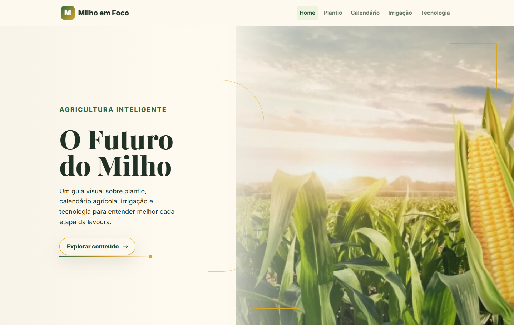
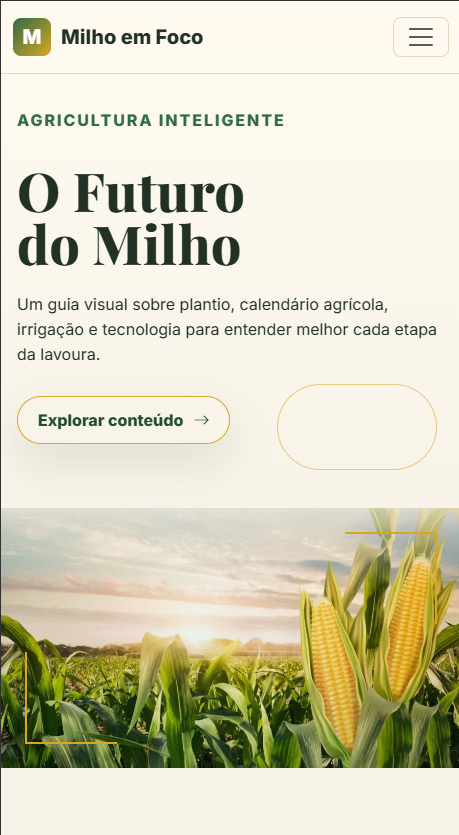

# Agricultural Culture 🌱

Sistema web desenvolvido com HTML, CSS e JavaScript voltado para apresentação de informações agrícolas em uma interface moderna e responsiva.

---

## 📌 Sobre o projeto

O Agricultural Culture é um projeto acadêmico desenvolvido com o objetivo de praticar conceitos de desenvolvimento web front-end, responsividade e organização de interfaces.

O sistema apresenta uma navegação intuitiva, design responsivo e estrutura moderna utilizando Bootstrap.

---

## 🚀 Funcionalidades

- Interface responsiva
- Navegação dinâmica
- Layout moderno
- Compatibilidade mobile
- Estrutura organizada de páginas

---

## 🛠 Tecnologias utilizadas

- HTML5
- CSS3
- JavaScript
- Bootstrap
- Git
- GitHub
- Vercel

---

## 🌐 Deploy

Acesse o projeto online:

https://agricultural-culture.vercel.app

---

## 📷 Screenshots

### Página inicial



### Versão mobile



---


## 📂 Estrutura do projeto

```bash
css/
 └── style.css

img/
 └── banner_hero.jpg
 └──home.png
 └──mobile.png

js/
 └── scripts.js

index.html
README.md
```

## 📖 Aprendizados

Durante o desenvolvimento deste projeto foram praticados:

- Estruturação semântica com HTML
- Responsividade com CSS e Bootstrap
- Organização de layout
- Manipulação visual da interface
- Controle de versão com Git/GitHub
- Publicação de aplicações com Vercel

---

## 👨‍💻 Autor

Rafael Santos

GitHub:
https://github.com/Raffaellsantos
